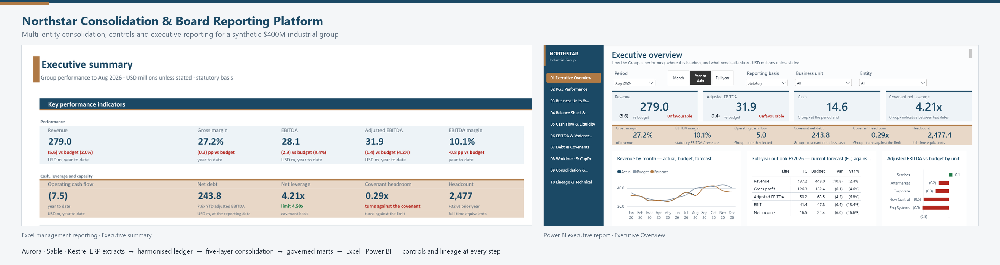
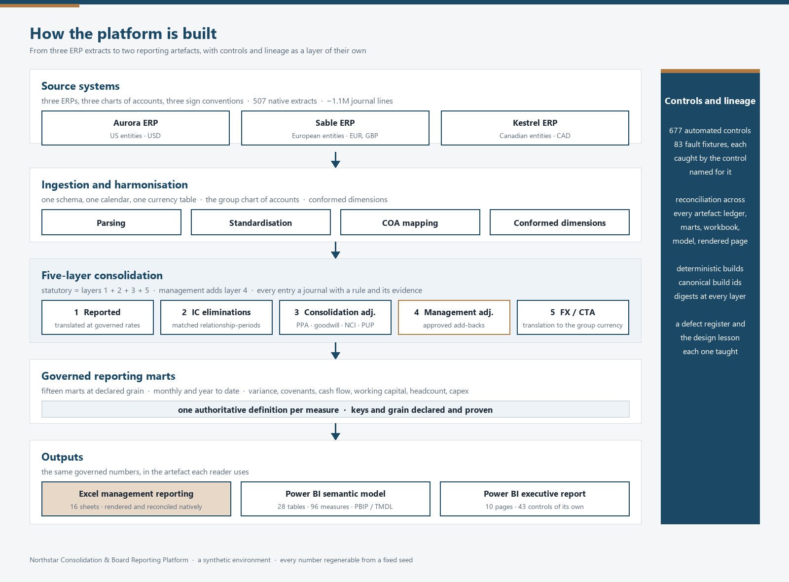
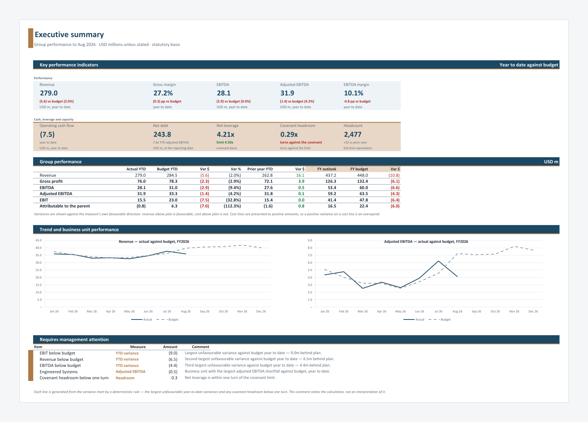
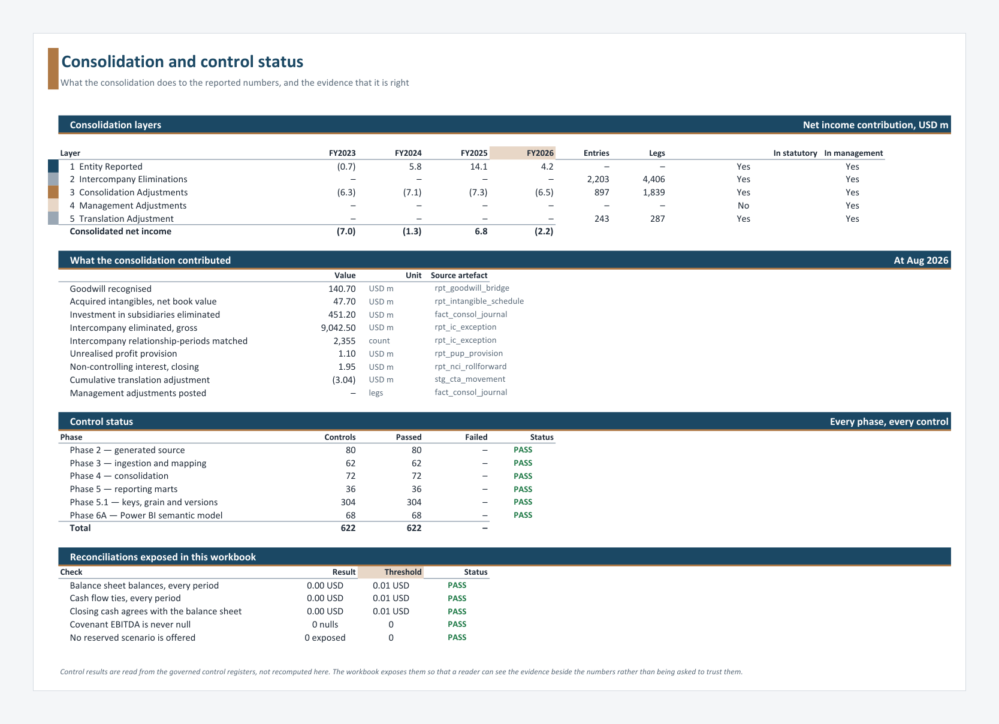
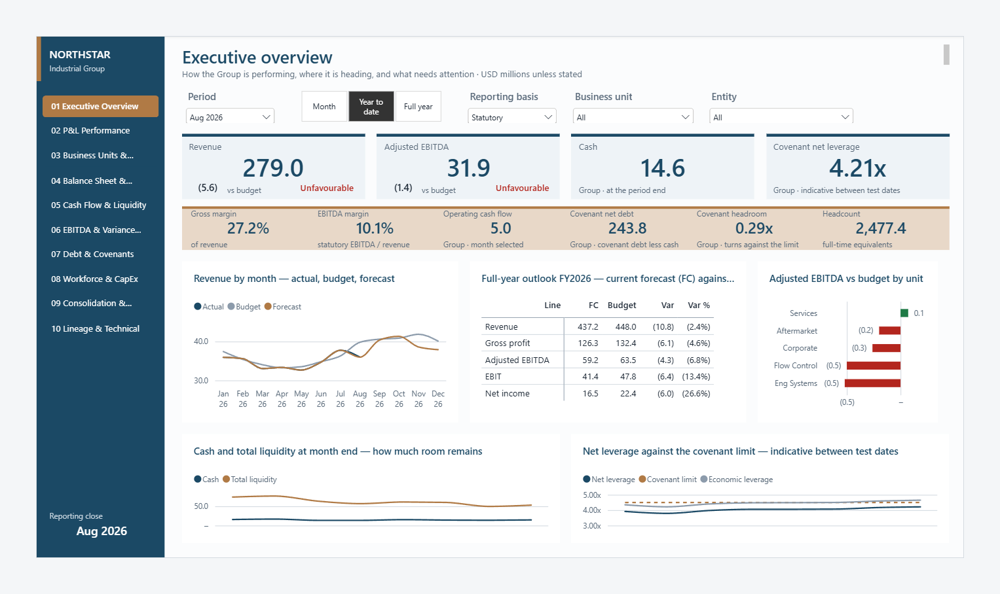
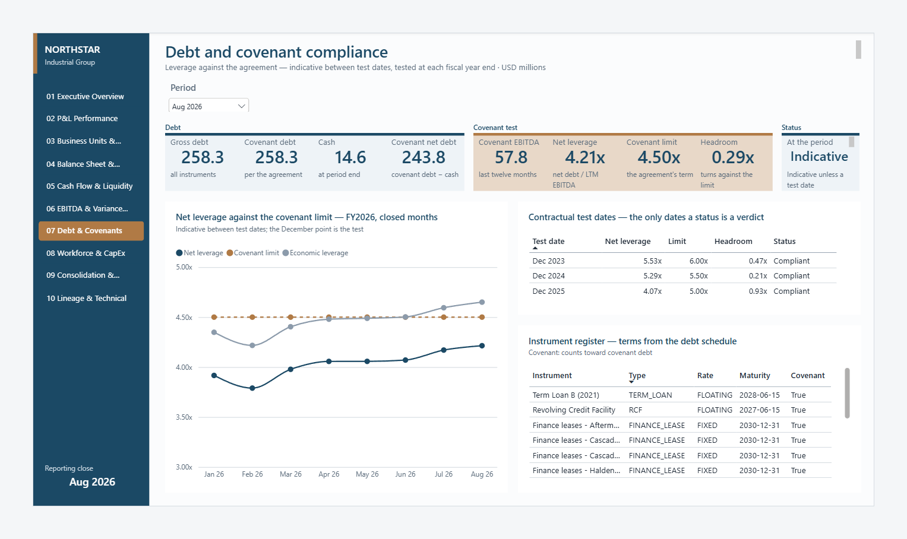
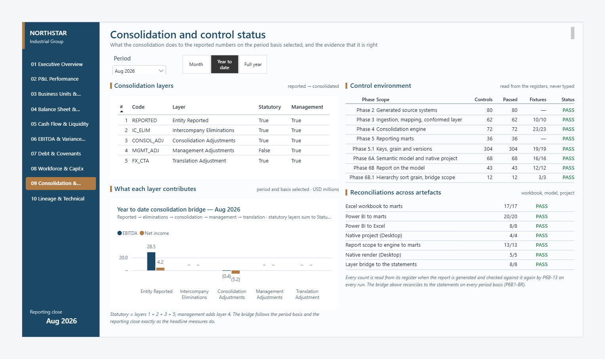
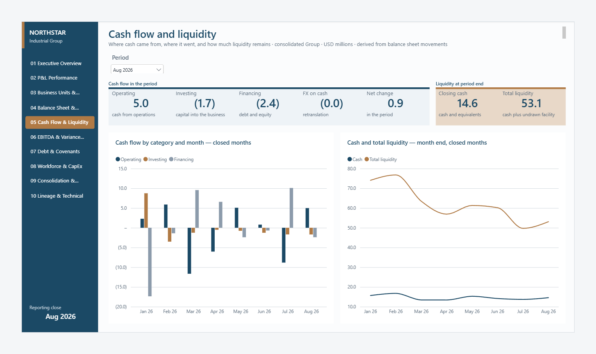
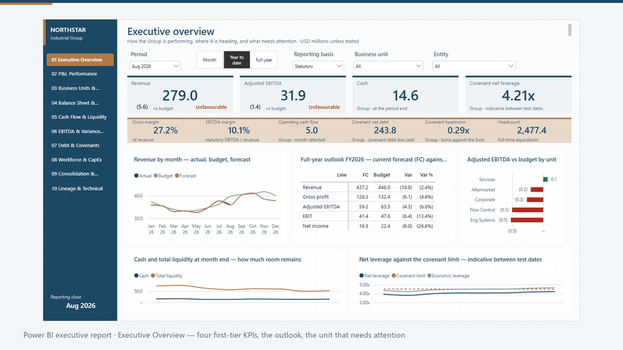

# Northstar Consolidation & Board Reporting Platform

**End-to-end multi-entity finance transformation for a synthetic $400M industrial group — from
heterogeneous ERP extracts through consolidation, controls, Excel management reporting and
Power BI executive analytics.**



Northstar Industrial Group is a fictional, PE-backed industrial group: twelve legal entities
in five countries, three ERP systems, four functional currencies, two acquisitions still being
digested, and a month-end that used to take four days in a spreadsheet. Everything in this
repository — the group, its ledgers, its consolidation and its reporting — is generated,
deterministic and reproducible from a fixed seed. The accounting is real; the company is not.

[Case study](docs/portfolio/case-study.md) ·
[Architecture](#how-it-is-built) ·
[Excel model](docs/excel-model.md) ·
[Power BI report](docs/powerbi-report.md) ·
[Why the numbers can be trusted](#why-the-numbers-can-be-trusted) ·
[Reproducibility](docs/reproducibility.md) ·
[Walkthrough video](docs/assets/portfolio/video/northstar-walkthrough.mp4)

---

## Executive summary

A finance leader inheriting Northstar faces the usual buy-and-build inheritance: three charts
of accounts, three sign conventions, FX translated by hand at annual rates with the
translation adjustment plugged to balance, intercompany reconciled by email, a cash flow
statement rebuilt every month, and covenant leverage that nobody can trace from the board
pack back to a journal.

This platform replaces that with one governed pipeline. Native ERP extracts are ingested,
standardised and mapped to a group chart of accounts; the group is consolidated in five
explicit layers; governed reporting marts carry one authoritative definition per measure;
and the same numbers reach an Excel management reporting workbook and a Power BI executive
report, each reconciled back to the marts and to each other. Every step is a control point,
every artefact carries a build identifier, and a defect register records what the controls
found on the way and what each finding changed in the design.

The result is management reporting a CFO can put in front of a board and a lender with a
traceable path from every figure to the source journal that produced it.

## The business scenario

| | |
|---|---|
| Group | Northstar Industrial Group, PE-backed, buy-and-build |
| Scale | ~$412M FY2025 revenue · ~2,450 FTE · four business units |
| Structure | 12 legal entities · US, Canada, UK, Germany, Netherlands · USD, CAD, GBP, EUR |
| Systems | three ERPs (Aurora, Sable, Kestrel) with different charts, formats and sign conventions |
| Volume | 507 native extracts · ~1.1M journal lines · FY2023–FY2026 with budget and rolling forecast |
| Complexity | two acquisitions with purchase price allocation, goodwill and non-controlling interests; intercompany trade and financing; unrealised profit in inventory; a net-leverage covenant tested at each fiscal year end |
| Reporting close | August 2026, year to date against budget, with the current forecast |

| | FY2023A | FY2024A | FY2025A | FY2026B | FY2026F |
|---|---|---|---|---|---|
| Revenue ($m) | 328.0 | 371.4 | 412.1 | 448.0 | 437.2 |
| Adjusted EBITDA ($m) | 39.0 | 47.2 | 57.8 | 63.5 | 59.2 |
| Net leverage (covenant) | 5.45x | 5.28x | 4.06x | 3.36x | 3.86x |
| Headcount | 2,180 | 2,340 | 2,450 | 2,530 | 2,486 |

A levered platform that absorbed two acquisitions at peak rates, then delivered margin
expansion and deleveraging — and is forecast to miss its FY2026 budget by $10.8m of revenue
for reasons that are specific and attributable. Full narrative:
[`docs/business-scenario.md`](docs/business-scenario.md).

## What was built

| Layer | Deliverable |
|---|---|
| Source | three synthetic ERP environments generated to hit pre-defined financial anchors, with 80 controls over the generated ledgers |
| Ingestion and harmonisation | parsing of every native format, sign and period normalisation, a chart-of-accounts mapping engine with acceptance evidence, conformed dimensions |
| Consolidation | a five-layer engine: reported, intercompany eliminations, consolidation adjustments (PPA, goodwill, NCI, unrealised profit), management adjustments, FX and CTA — every entry a journal with a rule and its evidence |
| Reporting marts | fifteen governed marts at declared grain, with monthly, year-to-date and full-year bases, variance and favourability decided once |
| Excel | a sixteen-sheet management reporting workbook, refreshed from the marts, calculated and rendered natively, reconciled 17 ways |
| Power BI | a governed semantic model (28 tables, 96 measures, PBIP/TMDL) and a ten-page executive report generated from declarations, both validated in the engine and in Power BI Desktop |
| Controls and lineage | 677 automated controls across eight registers, 83 fault fixtures, cross-artefact reconciliation, deterministic build ids and a defect register |

## How it is built



The consolidation is five explicit layers, and the two reporting bases are compositions of
them: statutory is layers 1 + 2 + 3 + 5, management adds the approved add-backs of layer 4.
Nothing is netted before it is understood, so the reconciliation from what the ERPs said to
what the board sees is a standing output, not an investigation. Design:
[`docs/consolidation-engine.md`](docs/consolidation-engine.md) ·
[`docs/data-lineage.md`](docs/data-lineage.md).

## Executive reporting

The same governed numbers reach two artefacts, each in the form its readers use, and each
reconciled to the marts and to the other.

### Excel management reporting



Sixteen report sheets on one style system: KPI tiles with the governed variance and its
direction, the income statement on the reader's basis, cash flow derived from balance sheet
movements and checked every month, working capital, the three EBITDA definitions and their
bridge, debt and covenant compliance, workforce and capital, FX, and — beside the numbers —
the consolidation layers and every phase's control status. Refreshed from the marts, calculated
and rendered by Excel itself, reconciled seventeen ways.
[`docs/excel-model.md`](docs/excel-model.md) · [`docs/excel-style-guide.md`](docs/excel-style-guide.md)



### Power BI executive report



Ten pages generated from declarations on a governed semantic model. The Executive Overview is
built to be read in thirty seconds: four first-tier figures with their variance and direction,
six second-tier, the year so far, the full-year outlook, the unit that needs attention, cash
and leverage against the covenant limit. Every number on every page is an explicit measure in
a scope the visual states; selecting a business unit narrows what is unit-level and leaves what
is Group-level, and says which is which.
[`docs/powerbi-report.md`](docs/powerbi-report.md) · [`docs/powerbi-semantic-model.md`](docs/powerbi-semantic-model.md)



The covenant page gives a verdict only where the agreement gives one — at a fiscal year end —
and reads *Indicative* everywhere else. Telling a board it breached a covenant it did not
breach is the most expensive mistake a reporting layer can make.



The consolidation page shows what each layer contributed on the period basis selected — the
year-to-date bridge sums to year-to-date statutory EBITDA to the cent — and the control
environment of every phase, read from the registers when the report is generated, never typed.



A short preview of the report in use — a business unit chosen, the cutoff read, the covenant
and consolidation pages visited:



The full walkthrough (2:45) is at
[`docs/assets/portfolio/video/northstar-walkthrough.mp4`](docs/assets/portfolio/video/northstar-walkthrough.mp4).

## The questions the platform answers

* How are Group revenue and EBITDA tracking against plan, and what is the full-year outlook?
* Which business unit explains the variance, and which entity within it?
* How much liquidity remains, and where did cash come from and go?
* What is covenant leverage and headroom, and when is it actually tested?
* What did the consolidation entries do to the reported result, layer by layer?
* How do statutory, management-adjusted and covenant EBITDA differ, and why?
* Where are working-capital pressures building?
* How is capital expenditure progressing against approval?
* Can management trace any reported number to its governed source and build?

## Why the numbers can be trusted

**A model can balance, render and still be wrong.** The controls in this platform were
designed on that principle, and they have proved it repeatedly: most of the defects in the
register were found in artefacts that balanced, reconciled or rendered perfectly.

Three ideas do most of the work.

* **Test from the authoritative population, not the output.** A control that iterates what
  was produced can only find wrong rows; the rows that are missing are invisible. Investments
  are checked from the investment register, intercompany from the relationship matrix, FX
  from the rate calendar, keys from a declared registry.
* **Reconcile across artefacts.** The ledger, the marts, the workbook, the semantic model and
  the rendered page each express the same measures, and each is reconciled to the others by
  a control that evaluates the real artefact — real DAX in the real engine, the real workbook
  calculated by Excel, the real page read from Power BI Desktop — never a re-implementation
  written by the same hand on the same afternoon.
* **Prove the controls with faults.** Every control family has fixtures that put a specific
  defect back and require the control *named for it* to fail. Detection by some other control
  does not count.

Some of what the controls found, each now a permanent control and a design lesson:

| what the platform said | what was true |
|---|---|
| the investment register and the ledger both balanced | an investment existed in the register and not in the ledger |
| a historical FX rate was valid | it was the right rate for the wrong period |
| the balance sheet closed | because a reserve had been created to make it close |
| intercompany was fully eliminated | the control could not see the counterparties that were missing |
| 1,846 capital projects were reported | under 395 identifiers, because the key was never a key |
| prior-year comparisons were populated | from a version code that existed in no version master |
| the Power BI model loaded and evaluated | and Power BI Desktop refused to open the project |
| every business-unit figure reconciled | because the business unit dimension filtered nothing |
| variance percentages were stored and summed | and EBIT variance read 2,713.9% |
| the caption hierarchy sorted | by a key at account grain, so each caption appeared once per account |

The full record: [`docs/defect-register.md`](docs/defect-register.md) and the design lesson
each one taught, [`docs/architecture-lessons.md`](docs/architecture-lessons.md).

### The evidence, as it stands

| | |
|---|---|
| automated controls | **677**, in eight registers: 80 source · 62 pipeline · 72 consolidation · 36 marts · 304 keys and grain · 68 semantic model · 43 report · 12 hierarchy and bridge scope — all passing |
| fault fixtures | **83**, every one handled by the control named for it |
| reconciliations | 17 workbook-to-mart · 20 Power BI-to-mart · 8 Power BI-to-workbook · 13 report-scope-to-engine-to-mart · 8 consolidation-bridge-to-statement |
| tests | 588 automated tests over accounting identities, seeds, datasets, the model and the report |
| deterministic builds | every phase carries a canonical build id that survives a checkout; two clean generations produce identical digests |
| native validation | the workbook calculated and rendered by Excel; the project opened, refreshed and read in Power BI Desktop |

Counts are read from the committed registers under `data/`, and the same registers are what
the workbook's control-status sheet and the report's Consolidation & Controls page display.

## Reproducibility and testing

Same inputs, same outputs, byte for byte, with no manual step in the critical path. The
generated data (~166 MB) is not committed; the manifests, per-file checksums, control results
and samples that prove a rebuild is identical are. A full rebuild from source extracts to
both reporting artefacts runs in minutes and every phase's build id is recomputed and compared
with the committed manifest. Procedure, runtimes and identifiers:
[`docs/reproducibility.md`](docs/reproducibility.md).

## Technology

Python 3.12 · DuckDB and SQL · Excel (openpyxl authoring, Excel COM for calculation, layout QA
and PDF rendering) · Power BI in PBIP/TMDL/PBIR form with DAX, deployed and executed through
Analysis Services and exercised in Power BI Desktop through UI automation · pytest.

The tooling is supporting evidence. The product is the finance architecture and the controls
around it.

## Development approach

The platform was built in phase gates, each with an owner brief, explicit acceptance criteria,
a written phase report and a review before the next phase began. AI-assisted development was
used to accelerate implementation; the finance architecture, accounting policies, control
design, review gates and acceptance criteria were explicitly governed and independently
validated at each gate, and every correction in the defect register was decided at the owner's
review rather than in the code.

## Repository structure

```
config/          Version-controlled inputs: anchors, charts of accounts, entities, FX, debt, controls
data/            Committed manifests, control registers, samples and the Excel deliverable
docs/            Design, per-phase reports, the defect register, portfolio material and assets
powerbi/         The Power BI project: semantic model (TMDL) and report (PBIR), generated
sql/             The transformation layer, ordered by pipeline stage
src/             anchors · generation · pipeline · consol · marts · excel · integrity · powerbi
tests/           588 automated tests
tools/           Diffs, reproducibility checks, documentation and portfolio asset builders
```

## Documentation

| Start here | |
|---|---|
| [Case study](docs/portfolio/case-study.md) | the engagement as a consulting case study |
| [Business scenario](docs/business-scenario.md) | the company, its entities, ERPs, capital structure and the FY2026 story |
| [Project charter](docs/project-charter.md) | the problem, scope, success criteria and risks |
| [Roadmap and phase reports](docs/phases/roadmap.md) | every phase, its gate and its report |
| [Defect register](docs/defect-register.md) · [Architecture lessons](docs/architecture-lessons.md) | what the controls found, and what each finding changed |

| The consolidation | |
|---|---|
| [Consolidation engine](docs/consolidation-engine.md) · [design](docs/consolidation-design.md) | layers, facts, ownership traversal, build sequence |
| [FX translation](docs/fx-translation.md) · [FX and CTA policy](docs/fx-cta-policy.md) | rates, opening balances, a derived CTA |
| [Intercompany elimination](docs/intercompany-elimination.md) | pair-level matching and classification |
| [Investment and PPA](docs/investment-and-ppa.md) · [NCI](docs/nci.md) · [Unrealised profit](docs/unrealised-profit-in-inventory.md) · [Management adjustments](docs/management-adjustments.md) | the consolidation adjustments |
| [Consolidated financial statements](docs/consolidated-financial-statements.md) · [Consolidation controls](docs/consolidation-controls.md) | the statements and the 72-control suite |

| The reporting layer | |
|---|---|
| [Reporting marts](docs/reporting-marts.md) · [Reporting artefact contract](docs/reporting-artefact-contract.md) | the governed marts and their grain |
| [Excel model](docs/excel-model.md) · [Excel style guide](docs/excel-style-guide.md) · [Reporting controls](docs/reporting-controls.md) | the workbook |
| [Power BI semantic model](docs/powerbi-semantic-model.md) · [measures](docs/powerbi-measures.md) · [report](docs/powerbi-report.md) · [style guide](docs/powerbi-style-guide.md) · [controls](docs/powerbi-controls.md) | the model and the report |
| [Key and grain framework](docs/key-and-grain-framework.md) · [Control framework](docs/control-framework.md) · [Fault testing](docs/fault-testing.md) | the control architecture |
| [Data lineage](docs/data-lineage.md) · [Reproducibility](docs/reproducibility.md) | from native extract to board figure, and back |

| The sources | |
|---|---|
| [Source system design](docs/source-system-design.md) · [Synthetic data methodology](docs/synthetic-data-methodology.md) | the three ERPs and how their ledgers are generated |
| [Ingestion design](docs/ingestion-design.md) · [Mapping engine](docs/mapping-engine.md) · [Source-to-group reconciliation](docs/source-to-group-reconciliation.md) | harmonisation and its evidence |
| [ADRs](docs/adr/README.md) · [Glossary](docs/glossary.md) | decisions and terms |

## Running the project

Windows, Python 3.12, Excel and Power BI Desktop for the native steps (the data and control
layers run anywhere).

```bash
python -m pip install -r requirements.txt

python -m src.generation.build         # generate the source systems (~30 s, ~1.1M journal lines)
python -m src.generation.validate      # 80 source controls
python -m src.pipeline.run             # ingest, normalise, map and conform (~60 s)
python -m src.consol.run               # consolidate the group and run its control suite
python -m src.marts.run                # build the governed reporting marts
python -m src.excel.build              # build the Excel management reporting workbook
python -m src.excel.qa                 # calculate, inspect and render it in Excel
python -m src.integrity.controls       # prove every declared key and grain, source to mart
python -m src.powerbi.run --native     # generate model and report, deploy, control both, exercise the report in Desktop
python -m pytest tests -q              # 588 tests
```

Each `run` has a matching `faults` module that breaks its layer on purpose and proves the
control named for each fault catches it. Full procedure:
[`docs/reproducibility.md`](docs/reproducibility.md).

---

Northstar Industrial Group is fictional. All data is synthetic, deterministic and generated by
this repository; the company, its entities and its financials are constructed to be realistic,
internally consistent and non-trivial, and no real organisation's data was used.
