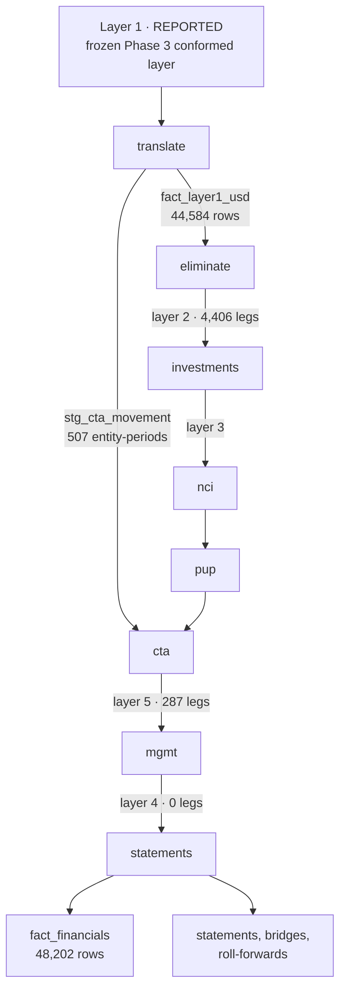
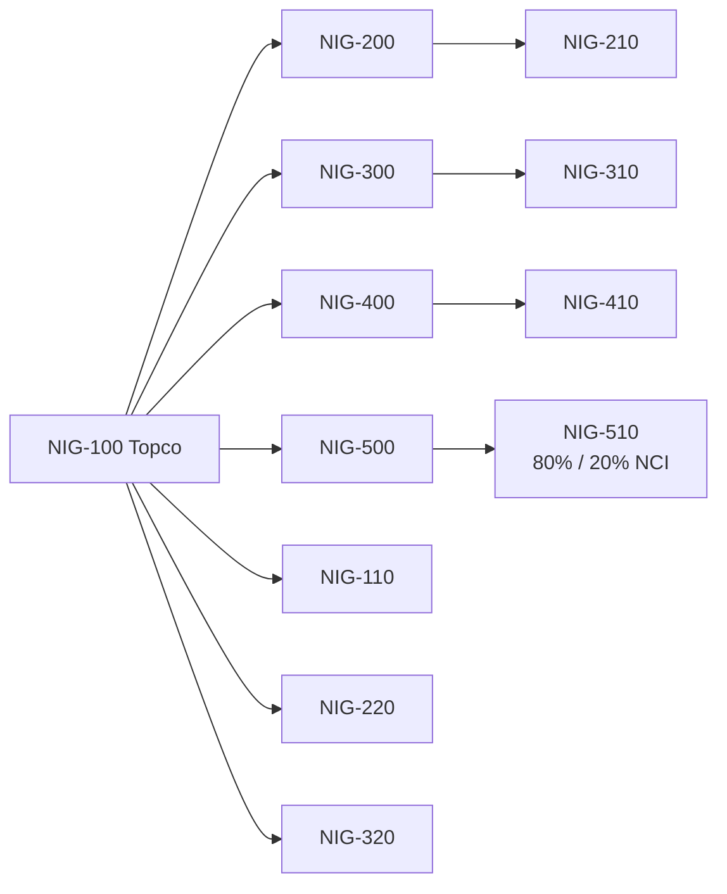

# The consolidation engine

The as-built reference for `src/consol/`. [`consolidation-design.md`](consolidation-design.md)
states the design intent and the accounting policy; this document states what the engine does,
in the order it does it, and where each number can be found.

Frozen at commit `4847d64`.

---

## 1. What it is for

Three ERPs close their own books in their own charts, in their own currencies, on their own
calendars. The engine turns those twelve entity ledgers into one consolidated group in USD,
and — this is the part that distinguishes it from a spreadsheet — it does so in a way that lets
anyone ask *why* a consolidated number is what it is and get an answer from the data rather
than from whoever built it.

Everything it produces is a deterministic function of two things: the frozen Phase 3.1
conformed layer, and committed configuration. Nothing reads a clock, a counter or an
environment. The same inputs give byte-identical outputs.

---

## 2. Architecture



The order is not arbitrary. NCI needs the consolidated result of its subsidiary, which needs
the layer-3 adjustments; the CTA posting needs the derivation that translation produced; the
statements need everything. `src/consol/run.py` enforces it.

---

## 3. The five layers

Every consolidated figure carries the layer it came from ([ADR-0003](adr/0003-consolidation-layer-model.md)).

| Layer | Code | What lives there | Posted to | Legs |
|---|---|---|---|---|
| 1 | `REPORTED` | entity ledgers as reported, translated to USD | the entity itself | 44,584 |
| 2 | `IC_ELIM` | intercompany eliminations | `ELIM-IC` | 4,406 |
| 3 | `CONSOL_ADJ` | investment elimination, PPA amortisation, NCI, unrealised profit | `ELIM-CON` | 1,839 |
| 4 | `MGMT_ADJ` | management adjustments | `ELIM-MGT` | 0 |
| 5 | `FX_CTA` | the cumulative translation adjustment | the foreign operation itself | 287 |

```
Statutory  = Layer 1 + Layer 2 + Layer 3 + Layer 5
Management = Statutory + Layer 4
```

The two bases are selected at the architecture level, in `vw_statutory_fact` and
`vw_management_fact`, from `dim_consolidation_layer.in_statutory_view` /
`in_management_view` — never by filtering at report time. A management normalisation cannot
reach the reported result by being filtered wrongly in a report, because it is not in the set
the report reads. `P4-LAY-03` proves it.

Layers 2, 3 and 4 post to virtual elimination entities ([ADR-0014](adr/0014-elimination-entities.md))
so that any entity's reported figures still agree with its own trial balance. Layer 5 is the
exception and posts to the foreign operation itself, because CTA is an attribute of a specific
operation — posting it to a virtual entity would make *"what is Halden's CTA?"* unanswerable.

### Why layer 5 does not balance on its own

Layers 2, 3 and 4 are double entries: each posts a debit and a credit and each sums to zero.
`P4-JNL-01` requires it.

Layer 5 does not, and must not. Under the current-rate method the income statement is
translated at average rates and the balance sheet at closing rates, so the translated trial
balance does not sum to zero. **CTA is exactly the amount by which it misses.** It is a
single-sided entry by construction: an entry that balanced within itself would leave the
translated trial balance still out, and the only way to make it balance would be to post the
other side somewhere it does not belong — which is what a plug is.

So layer 5 is tested differently. `P4-LAY-02` requires that **layers 1 and 5 together** sum to
zero in every period, to the cent. That is the only form in which the assertion is meaningful,
and it is a stronger test than a self-balancing entry would be: it says the derived CTA is
precisely the residual of the translation and not a number that happens to close the books.

---

## 4. Two facts, and the grain of each

[ADR-0024](adr/0024-two-reconciled-consolidation-facts.md).

**`fact_consol_journal`** — every consolidation entry, at leg grain.

| Column | Purpose |
|---|---|
| `consol_journal_id`, `line_number` | the entry and the leg within it |
| `layer_id`, `process`, `rule_id` | which layer, which engine, which configuration row |
| `entity_code` | where it is posted (`ELIM-IC`, `ELIM-CON`, `ELIM-MGT`, or the entity for CTA) |
| `related_entity_code` | which entity it is *about* |
| `partner_entity_code` | the counterparty, for intercompany |
| `narrative`, `evidence` | why, in words, and what it rests on |

**`fact_financials`** — the monthly consolidated position, at
entity × account × cost centre × partner × period × scenario × version × **layer**, 48,202
rows. Layer 1 comes from the translated ledgers; layers 2 to 5 are aggregated from the journal
fact, so the two cannot disagree — and `P4-FCT-01` proves it anyway. `journal_character`
travels with each row so a report can tell a year-end close from an ordinary posting, which is
what makes "the result for the period" computable at all.

### Deterministic identifiers

Journal ids are derived from the business keys the entry represents, never from a counter or a
clock:

```
IC-<sha256(holder, owing, account_set, period)[:12]>
INV-<acquisition_id>-<period>
NCI-<entity>-<period>
PUP-<seller>-<buyer>-<account>-<period>
CTA-<entity>-<period>
MGT-<md5(adjustment_id, period)[:10]>
```

The same entry has the same id in every rebuild, on every machine. That is what makes a
lineage reference stable enough to put in a report.

---

## 5. Ownership traversal

`dim_ownership_period` is built by a recursive walk over `ref_ownership`, one row per entity
per month — 555 rows. It carries the direct percentage, the **effective** group percentage
(the product down the chain), the effective NCI percentage, the path, and the number of tiers
to the ultimate parent.

Four of the twelve entities are held by an operating company rather than by Topco:



A flat register would consolidate the second tier one level too high and give each of those
entities its direct percentage as its group percentage. `P4-OWN-06` derives the expected
second-tier population from the register itself and compares.

---

## 6. Scenario and version

The engine is parameterised by `scenario_code` and `version_code` and carries both onto every
entry. Actual (`ACT` / `ACTUAL`) is consolidated in full. Budget and Forecast share the same
grain, the same engine and the same layers, with their own rate set — nothing about the
consolidation logic is specific to actuals. The reporting phases consume the same fact.

---

## 7. Build sequence

| Stage | Produces | Seconds |
|---|---|---|
| `ownership` | `dim_ownership_period` | 0.03 |
| `translate` | `fact_layer1_usd`, `stg_cta_movement` | 0.32 |
| `eliminate` | `stg_ic_position`, `stg_ic_match`, `rpt_ic_exception`, layer 2 | 0.12 |
| `investments` | `rpt_goodwill_bridge`, `rpt_intangible_schedule`, layer 3 | 0.05 |
| `nci` | `stg_nci_result`, `rpt_nci_rollforward`, layer 3 | 0.01 |
| `pup` | `stg_pup_layer`, `rpt_pup_provision`, layer 3 | 0.02 |
| `cta` | `rpt_cta_rollforward`, layer 5 | 0.01 |
| `mgmt` | `ref_management_adjustment`, `rpt_ebitda_bridge`, layer 4 | 0.01 |
| `statements` | `fact_financials` and every report | 0.51 |
| **total** | | **≈ 1.2** |

The journal table is truncated at the start of every run. Appending to whatever was there
before would double every entry and every total would still look plausible.

### The build id

`build_id()` is a SHA-256 over the declared inputs — the frozen source digest, the Phase 3
manifest, and the five configuration files the engine reads — truncated to 16 characters. It
is a property of the inputs, not of the run. Current value **`a99d9fba5694ad7d`** on source
layer `8013298c…`. Both moved at the Phase 5.1 rebaseline and neither the engine nor any
consolidated figure changed ([ADR-0026](adr/0026-a-declared-key-is-a-contract.md)).

---

## 8. Control gates

61 controls run at the end of every build and the run exits non-zero if any blocking control
fails. See [`consolidation-controls.md`](consolidation-controls.md). The design rule that
shapes all of them:

> **Controls iterate from the authority that requires the data, not from the data being
> tested.**

---

## 9. Where each number comes from

| Question | Artefact |
|---|---|
| What is consolidated revenue in March 2025? | `rpt_income_statement` |
| What is in group equity at December? | `rpt_balance_sheet` |
| Where did the cash go? | `rpt_cash_flow` |
| What did each layer contribute? | `rpt_layer_bridge` |
| Why did group equity move? | `fact_consol_journal`, filtered by `process` |
| How was goodwill arrived at? | `rpt_goodwill_bridge` |
| Which intercompany pairs did not agree? | `rpt_ic_exception` |
| What is the minority's share, and how did it move? | `rpt_nci_rollforward` |
| Statutory against management | `rpt_basis_comparison` |
| Did anything fail? | `data/phase04_control_results.csv` |
