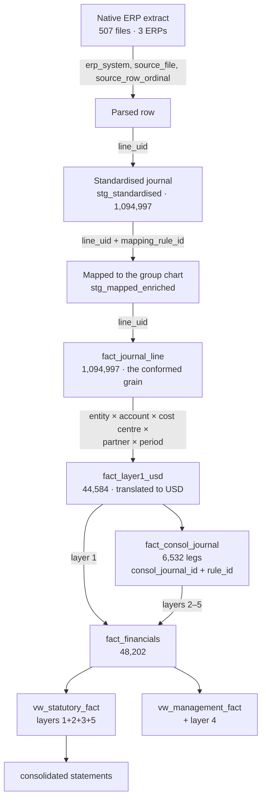

# Data lineage

Every consolidated number traces back to the line of an ERP extract that produced it. This
document names the identifier that carries the trace at each step.

The test is not whether lineage exists in principle. It is whether a controller can point at a
figure in a report and get back the journal lines behind it without asking anyone.

---

## The chain

## Identifiers, step by step

| Step | Grain | Identifier | Carries |
|---|---|---|---|
| Native extract | one file per entity-month per ERP | `erp_system`, `source_file` | the file as delivered, unmodified |
| Parsed row | one row per extract line | `source_row_ordinal` | the physical position in the file |
| Standardised | one journal line | **`line_uid`** | the condensed declared grain `(erp_system, source_file, journal_id, line_number)`, plus `ingest_build_id` |
| Mapped | one journal line | `line_uid` + **`mapping_rule_id`** | which rule assigned the group account, and `mapping_status` |
| Conformed fact | one journal line | `line_uid` | the grain is **enforced**, not assumed (`P3-ING-08`) |
| Translated layer 1 | entity × account × cost centre × partner × period | — | `translation_basis`, `rate_applied`, `amount_local`, `amount_usd`, `fx_revaluation_usd` |
| Consolidation entry | one leg | **`consol_journal_id`** + `line_number` | `layer_id`, `process`, **`rule_id`**, `related_entity_code`, `partner_entity_code`, `narrative`, `evidence` |
| Consolidated fact | monthly consolidation grain × layer | — | `layer_id`, `journal_character`, `process` |

Two properties make the chain usable rather than merely present:

* **`line_uid` survives every pipeline stage.** It is assigned once at standardisation and
  never regenerated, so a mapped row, a conformed row and a reconciliation exception all name
  the same source line.
* **`consol_journal_id` is derived from business keys**, not from a counter — so a lineage
  reference printed in a report today still resolves after a rebuild tomorrow.
* **Every identifier in the chain is proved unique over its own population**, on every
  build, by `src/integrity/controls.py`. An identifier nobody tests is a naming
  convention: `project_id` was in this table as a key while five capital programmes
  shared each value (P6-D-01, [ADR-0026](adr/0026-a-declared-key-is-a-contract.md)).
  The subledger chain has its own family, because that is where the defect did its
  damage:

      Capital Project ──► CapEx fact ──► Fixed Asset      (P7-CPX-01 … P7-CPX-09)

  proved link by link on the attributes that must agree — asset class, entity, period —
  and then on the money, because identifier integrity is only worth having if the
  amounts follow the identifier.

## Walking it backwards

*"Why is consolidated cost of sales 236.795m in FY2023?"*

1. `rpt_income_statement` gives the figure by period, business unit and entity.
2. `vw_statutory_fact` filtered to `group_account LIKE '5%'` and that year gives it by layer:
   layer 1 from the entity ledgers, layer 2 removing intercompany purchases, layer 3 adding the
   unrealised profit adjustment.
3. **Layer 2 and 3** rows carry `process` and `rule_id` — join to `fact_consol_journal` for the
   individual entries, each with its narrative, its counterparty and the register row that
   required it.
4. **Layer 1** rows carry entity, account, cost centre and period — join to `fact_journal_line`
   on that grain for the underlying journal lines.
5. Each journal line carries `line_uid`, decomposing to `erp_system`, `source_file`,
   `journal_id` and `line_number` — the physical line of the physical extract.
6. It also carries `mapping_rule_id`, so the reason it became a group cost-of-sales account is
   a row in `config/mapping/mapping_rules.csv` with an effective date and a rationale.

Six steps, no interpretation, no spreadsheet.

## What each layer contributes

`rpt_layer_bridge` answers the question one level up — where did the movement come from — for
EBITDA, net income and the movements in total assets and total equity, by layer and year. It is
the artefact that turns *"why is group EBITDA not the sum of the entities' EBITDA?"* from a
week of work into a single row.

## Into the semantic layer

    marts ──► data/35_semantic/ ──► PBIP / TMDL ──► Analysis Services

Power BI reads the governed marts and twelve conformed semantic dimensions, and nothing else.
No accounting definition is restated there: the model aggregates governed columns and selects
between them. The lineage is proved rather than asserted -- `P6-XAR` executes the model's own
measures against a live engine and reconciles them to SQL over the marts, and `P6-XAR-19` goes
one step further and recomputes revenue from `vw_statutory_fact` itself. See
[the semantic model](powerbi-semantic-model.md).

## For the reporting phases

Excel and Power BI consume `fact_financials` and the `rpt_*` artefacts. The lineage keys they
need to carry through so a reported figure stays traceable:

| Keep | Why |
|---|---|
| `layer_id` | statutory versus management, and which engine produced the row |
| `process`, `rule_id` | the consolidation entry behind an adjustment |
| `entity_code`, `related_entity_code`, `partner_entity_code` | whose figure it is, and against whom |
| `period_key`, `scenario_code`, `version_code` | when, and on which basis |
| `journal_character` | whether a row is a year-end close, which changes what "the period's result" means |

A report that aggregates these away is still correct and is no longer traceable — the drill-down
has to stop at whatever the model kept.

Every reporting artefact's grain, upstream fact, close logic and NULL policy is set out in
[`reporting-artefact-contract.md`](reporting-artefact-contract.md). A mart that redefines a
measure has forked the definition, and the fork will not be visible until two reports disagree
in front of the board.

