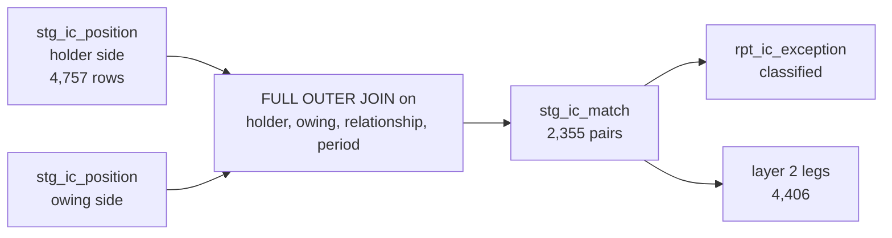

# Intercompany elimination

How `src/consol/eliminate.py` matches and removes intercompany balances and flows, why it does
so **by entity pair** rather than at group total, and what F02 proves about the difference.

[ADR-0023](adr/0023-intercompany-balances-are-built-pair-by-pair.md) records the decision.

---

## 1. The approved relationship population

Twelve entities trade with each other in five ways. The population is not inferred from what
the ledgers happen to contain — it is declared, in `config/ic/` and materialised as
`ref_ic_side`, which says for each group account whether it is the **holder** side or the
**owing** side of a relationship, and which relationship it belongs to.

| Relationship | Holder accounts | Owing accounts |
|---|---|---|
| `IC_BALANCE` | 120500 receivable · 125100 short-term loan · 175100 long-term loan | 210500 payable · 225100 short-term loan · 235100 long-term loan |
| `IC_FLOW` | 490100 goods · 490200 management fee · 490300 shared services · 490400 royalty · 795100 interest income | 590100 goods · 590200 royalty · 695100 management fee · 695200 shared services · 695300 other · 795200 interest expense |

The five economic flows behind those accounts:

| Flow | From | To | Basis |
|---|---|---|---|
| Goods | manufacturing entities | distribution entities | cost plus 10–12% |
| Management fee | Topco | operating entities | % of revenue |
| Shared services | NIG-110 | consuming entities | cost recharge |
| Royalty | brand owner | licensees | % of revenue |
| Interest | intercompany lenders | borrowers | on the loan balance |

## 2. Every posting names its counterparty

`partner_entity_code` is populated at source generation on both sides of every intercompany
posting and survives ingestion, mapping and conformance. Without it there is no pair to
reconcile, and the reconciliation reduces to comparing group totals — which is where this
control was weakest before Phase 3.1.

## 3. Matching is done at the pair, on account **sets**

Two sides are built independently and joined:



The join is a **full outer** join, so a side with no counterpart survives as a row rather than
disappearing. That is the whole point: a missing counterparty is the defect, and an inner join
would delete the evidence.

Matching uses account **sets** rather than account pairs. Sable and Kestrel substitute
different local accounts that map to the same group account, so a receivable booked by one
entity may face a payable the other entity records under a different account in the same set.
Netting a pair account-by-account would report differences that are not differences. Netting
the pair across its whole account set reports only real ones.

## 4. Balances net cumulatively; flows net on the movement

An intercompany **balance** is a position. The matched amount is the cumulative position at
each month end, so the elimination posted is the **first difference** of the cumulative
elimination:

```
elimination(t) = matched_cumulative(t) − matched_cumulative(t−1)
```

Posting the monthly cumulative balance directly would eliminate the same receivable 36 times.
That was a real defect during construction and its signature is characteristic: totals grow
smoothly, nothing fails, and the group's intercompany balances go steadily and enormously
negative.

An intercompany **flow** is already a movement, so it eliminates as posted.

## 5. Classification of differences

Every pair-period is classified. A difference nobody has classified is indistinguishable from
one nobody has looked at, and `P4-IC-05` requires a classification on every row.

| Type | Meaning |
|---|---|
| `MATCHED` | the two sides agree within USD 1.00 |
| `MISSING_COUNTERPART` | one side posted, the other did not |
| `TIMING_DIFFERENCE` | the amounts agree in an adjacent period |
| `FX_DIFFERENCE` | the sides are in different currencies and the difference is explained by rate |
| `AMOUNT_MISMATCH` | neither timing nor FX explains it |

On the clean baseline **all 2,355 relationship-periods are `MATCHED`**: 34 ordered entity
pairs, 1,409 balance periods and 946 flow periods.

## 6. Tolerance and residual handling

`TOL_IC_RESIDUAL_USD = 1.00`, per entity pair, per period. It is a **currency rounding**
allowance and not an allowance for a difference — the worst measured residual is **USD 0.19**
on balances and **USD 0.01** on flows against gross matched positions of USD 8,866.7m and
USD 175.7m respectively.

Residuals are never carried to an "unattributable difference" account. The engine posts the
matched amount and reports what did not match; nothing sweeps a remainder into equity.

| Control | Assertion | Measured |
|---|---|---|
| `P4-IC-01` | every relationship nets, by pair | 0 unmatched, worst 0.19 USD |
| `P4-IC-02` | the population is not empty | 2,355 pairs |
| `P4-IC-03` | consolidated IC balances are nil | ≤ 1.00 USD cumulative |
| `P4-IC-04` | consolidated IC income and expense are nil | ≤ 1.00 USD |
| `P4-IC-05` | every difference carries a classification | 0 unclassified |

`P4-IC-02` looks trivial and is not. A pair reconciliation over no pairs passes perfectly, and
that is exactly what a matching engine that has stopped working looks like.

---

## 7. F02 — a worked control example

**The fixture.** One line of the Aurora extract is altered so that USD 45,000 is removed from
one side of an intercompany pair. Nothing else changes.

**Why every Phase 3 control was right to pass.** The file parses. The journal balances — the
entity that made the posting made it correctly as far as its own books are concerned. The
account maps. The dimension resolves. Both trial balances close. There is no Phase 3 artefact
in which the two sides of the pair meet, so there is nothing for a Phase 3 control to compare.
Phase 3 recorded it as `NOT_APPLICABLE_DEFERRED` with that reasoning written down, and named
the Phase 4 control that would own it.

**What happens in Phase 4.** The fixture runs through the entire pipeline — parsing, sign and
period normalisation, dimension conformance, mapping, the conformed layer — and then through
the elimination engine. The holder side reports 45,000 more than the owing side for that pair
and period. `stg_ic_match` produces a residual four orders of magnitude above the USD 1.00
threshold, and:

```
F02   DETECTED   P4-IC   P4-IC-01;P4-IC-03;P4-IC-04
```

`P4-IC-01` is the control that owns the risk. `P4-IC-03` and `P4-IC-04` fire downstream of the
same break. **Detection by an unrelated control would not have closed the deferral** — the
fault harness records that case separately, as `ACCIDENTAL_DETECTION`, and treats it as a
control-design defect.

### Why the pair matters

Suppose the same 45,000 were checked at group level: sum all intercompany receivables, sum all
intercompany payables, compare. Across 34 pairs and USD 8.9bn of gross positions, a 45,000
one-sided difference is 0.0005% of the total — and it nets against every other pair's rounding
in the same figure. The test would pass.

More seriously, a group total passes whenever the differences happen to offset. Two pairs each
wrong by 45,000 in opposite directions produce a perfect group total and two wrong entity
balance sheets. The pair-level control cannot be satisfied that way: each pair has to agree on
its own, and there is nothing for an error to hide behind.

That is the general form of the rule this project keeps rediscovering — a control's population
must be the thing that requires the data, and for intercompany that thing is the **pair**, not
the group.
