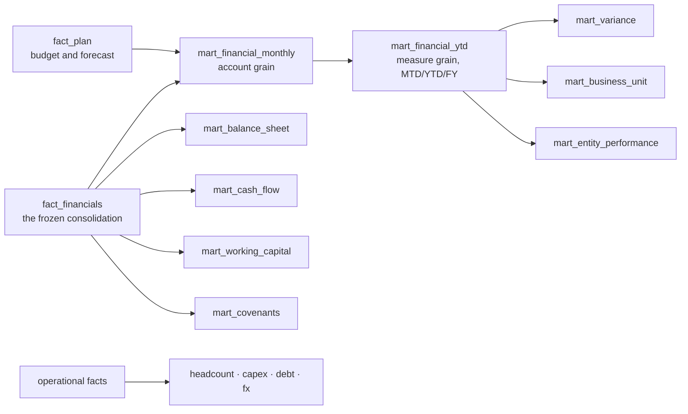

# The governed reporting marts

Nineteen published marts between the frozen consolidation and everything that reads it. Excel
reads these; Power BI will read these; nothing downstream queries `fact_financials` directly
and nothing downstream re-derives an accounting definition.

    python -m src.marts.run

---

## Scenario and version

One authoritative source for what a valid version is: `dim_report_scenario`, built from the
governed master in `config/dimensions/scenario_version.csv`. `ref_default_version` is
`SELECT scenario_code, version_code FROM dim_report_scenario WHERE is_default` and nothing
else — it used to union Prior Year in by hand, because `PY_DERIVED` had no version row to be
the default of ([ADR-0027](adr/0027-a-derived-version-is-still-a-governed-version.md)).

| scenario | default version | |
|---|---|---|
| `ACT` | `ACTUAL` | one version; restatements are adjustment postings, never overwrites |
| `BUD` | `BUD_FY26_V1` | locked on board approval |
| `FC` | `FC_FY26_08` | three forecasts retained, only the current one is the default |
| `PY` | `PY_DERIVED` | **derived**: Actual at *t − 12*, stored nowhere, locked |
| `DS` | — | reserved and unpopulated; excluded by `P5-SCN-02` and `P7-VER-12` |

A derived version is admitted to `dim_report_scenario` when the scenario it derives from has a
populated default version, not when rows exist carrying its own code — a derived version has
none by construction, and testing it for stored rows is what excluded Prior Year from the
dimension that governs what a report may offer.

`P7-VER-01` … `P7-VER-14` govern this: every version code in every fact and mart resolves,
each version is compatible with its scenario, each scenario has exactly one default, no default
exists outside the master, and the derived-version policy holds.

## 1. Why a mart layer at all

The consolidation fact is shaped for accounting: entity × account × cost centre × partner ×
period × scenario × version × layer, signed the way a ledger signs things, with the year-end
close in it. A report needs measures, a hierarchy, a comparison and a management sign
convention. Something has to do that reshaping, and there are only three places it can happen.

| Where | What goes wrong |
|---|---|
| In each report | Every tool derives EBITDA its own way and two reports disagree in front of the board |
| In the fact | The accounting layer acquires presentation concerns and stops being auditable |
| **In a mart layer** | — |

So: one reshaping, in one place, tested against the fact it came from.

## 2. What is in them

| Mart | Grain | Rows |
|---|---|---|
| `mart_financial_monthly` | basis × scenario × version × entity × BU × cost centre × account × month | 133,558 |
| `mart_financial_ytd` | basis × scenario × version × entity × BU × measure × month, with MTD, YTD and FY | 44,184 |
| `mart_variance` | comparison × basis × entity × BU × measure × month | 50,652 |
| `mart_business_unit` | basis × scenario × version × BU × measure × month | 18,032 |
| `mart_entity_performance` | basis × scenario × version × entity × measure × month, with cash, working capital and FTE | 41,832 |
| `mart_balance_sheet` | caption × account class × month, with prior month and prior year | 1,296 |
| `mart_cash_flow` | month, with year-to-date columns and liquidity | 48 |
| `mart_working_capital` | month, with DSO, DIO, DPO and the conversion cycle | 48 |
| `mart_headcount` | entity × department × job family × month | 22,215 |
| `mart_capex` | project × month | 1,846 |
| `mart_debt` | instrument × month | 595 |
| `mart_covenants` | month, on a rolling twelve-month EBITDA | 33 |
| `mart_fx` | currency × month, rates, exposure, constant currency and CTA | 176 |
| `mart_management_adjustments` | adjustment, with what was actually posted | 2 |
| `mart_consolidation_bridge` | layer × fiscal year | 20 |
| `dim_report_scenario` · `dim_report_measure` · `dim_report_comparison` · `dim_report_ratio` | the reporting dimensions | 5 · 14 · 4 · 3 |

## 3. The measure model

Fourteen measures, in presentation order, defined once in `src/marts/config.py` and stored —
**including the subtotals**. A subtotal computed in a spreadsheet is a definition living in a
spreadsheet, so gross profit, EBITDA, Adjusted EBITDA, EBIT, net income and the parent
attribution are all rows in the mart, and `P5-CAL-01` proves each equals its components.

Each measure carries a **favourable direction**, which is what makes variance colouring
account-aware. Revenue above plan is favourable; operating expense above plan is not; add-backs
and the minority attribution are neutral. `P5-VAR-02` proves the rule is applied by measure and
not by sign, and `P5-VAR-03` proves both answers actually occur — a rule that only ever returns
one answer has not been exercised.

Margins are held separately from measures, because a margin is not additive and must never be
summed across periods or entities.

## 4. Scenarios, versions and the prior year

| Scenario | Source | Note |
|---|---|---|
| Actual | `fact_financials`, fully consolidated | both bases |
| Budget | `fact_plan`, entity-level, translated at **budget** rates | FY2026 only |
| Forecast | `fact_plan`, three retained versions, translated at **forecast** rates | the current one is the default |
| Prior year | Actual, offset twelve months | derived, never stored (ADR-0004) |
| Downside | — | **reserved and never offered** |

Plan is translated at the rate set its own scenario declares, so a plan variance is never
contaminated by a rate movement the plan could not have known about.

Three forecasts are retained and exactly one is the default. `P5-SCN-03` enforces that: a
superseded forecast presented as *the* forecast is a reporting error nobody would notice.
`P5-SCN-01` enforces that the reserved Downside scenario appears nowhere, because offering it
would hand a reader an empty report that looks like a real one.

## 5. The one comparability rule

Budget and Forecast are **not consolidated**. No elimination engine runs on them, because a
plan is built at entity level and no group posts a consolidation journal to a budget. So every
reporting measure **excludes the intercompany account sets on both sides of every comparison**.

* On **Actual** that changes nothing — the consolidation has already netted them to zero, and
  `P5-CMP-01` proves the residual is within the Phase 4 intercompany tolerance.
* On **plan** it removes the internal trade, which is what makes the two comparable at all.
  `P5-CMP-02` proves the plan really does contain intercompany rows, because a rule that
  excludes nothing looks exactly like a rule that works.

The account sets come from `ref_ic_side` — the same configuration the Phase 4 engine matches
on — so this is a presentation rule and not a second elimination engine.

**What a plan comparison can and cannot say.** Plan carries no PPA amortisation, no unrealised
profit, no NCI attribution and no CTA, because those are consolidation entries and a plan has
none. A budget variance is like for like down to EBIT and is not below it. `is_comparable` says
which, on every row, rather than leaving a reader to find out.

## 6. Covenant leverage is measured over twelve months

Leverage is net debt at a point in time against **twelve months** of covenant EBITDA. Using a
fiscal-year figure for a year in progress divides a full net debt balance by a part-year
result: at August 2026 that produced **7.38x against a 4.50x limit** and reported a covenant
breach that does not exist. The twelve months to the same date is **4.21x**, and compliant.

The definition does not change — which add-backs are permitted and the sponsor fee cap are
settled in `rpt_ebitda_bridge` and in the credit agreement's own terms. Only the window does,
and `P5-COV-01` proves it: at each fiscal year end the rolling twelve months **is** the fiscal
year, so the two must agree to the cent. They do.

| At 31 December | Net debt | Covenant EBITDA | Leverage | Limit | Headroom |
|---|---|---|---|---|---|
| 2023 | 212.8 | 38.5 | 5.53x | 6.00x | 0.47x |
| 2024 | 249.3 | 47.1 | 5.29x | 5.50x | 0.21x |
| 2025 | 234.8 | 57.8 | 4.07x | 5.00x | 0.93x |
| Aug 2026 *(indicative)* | 243.8 | 57.8 | 4.21x | 4.50x | 0.29x |

## 7. Controls — 36, all passing

Phase 4C's rule carries forward and widens: **different artefacts expressing the same measure
must reconcile to one authoritative definition**, and a mart is an artefact. Every
reconciliation has one side recomputed from `fact_financials` and never both sides from the
same reporting calculation.

| Family | Controls | What it protects |
|---|---|---|
| `P5-REC` | 5 | the marts against the consolidated fact and the approved statements |
| `P5-GRN` | 3 | the declared grain, and that every declared measure is populated |
| `P5-CAL` | 2 | stored subtotals equal their components; YTD and FY are the sums of their months |
| `P5-SCN` | 4 | reserved scenarios absent, versions populated, one default each, complete plan years |
| `P5-BAS` | 2 | no management adjustment reaches the statutory mart |
| `P5-CMP` | 3 | the comparability rule is a no-op on Actual and does something on plan |
| `P5-VAR` | 4 | variance arithmetic, account-aware favourability, every comparison populated |
| `P5-AGG` | 2 | business unit and entity totals reconcile to the measure mart |
| `P5-COV` | 5 | covenant EBITDA, the limit ladder, headroom, no null, no partial window |
| `P5-OPS` | 4 | headcount, capex and debt reproduce their facts and roll forward |
| `P5-FX` | 2 | the translation adjustment is the engine's, and constant currency is nil at a rate of one |

Full detail: [`reporting-controls.md`](reporting-controls.md).

### One control that was wrong, and what it taught

`P5-OPS-02` was first written as `opening FTE + hires − leavers = closing FTE`. It failed by up
to 0.7 a month — and the **data was right and the control was wrong**. Hires and leavers are
counts of people; FTE is fractional, because a part-time joiner is one hire and 0.6 of an FTE.
Netting a count against a fraction is not an identity, it is a category error.

What the data does support, exactly, is continuity: each month's opening FTE is the prior
month's closing at the finest grain, to 0.0000. That is what the control now asserts, alongside
a direction check that net hiring and the FTE movement do not contradict each other.

## 8. Determinism

The marts are a function of the frozen consolidation and the committed reporting
configuration. Every artefact is written under `ORDER BY ALL`; the build id is a digest of the
inputs, not of the run; and the manifest records the consolidation build and source digest the
marts were built on, so a mart can never silently belong to a different consolidation than the
one it claims.
